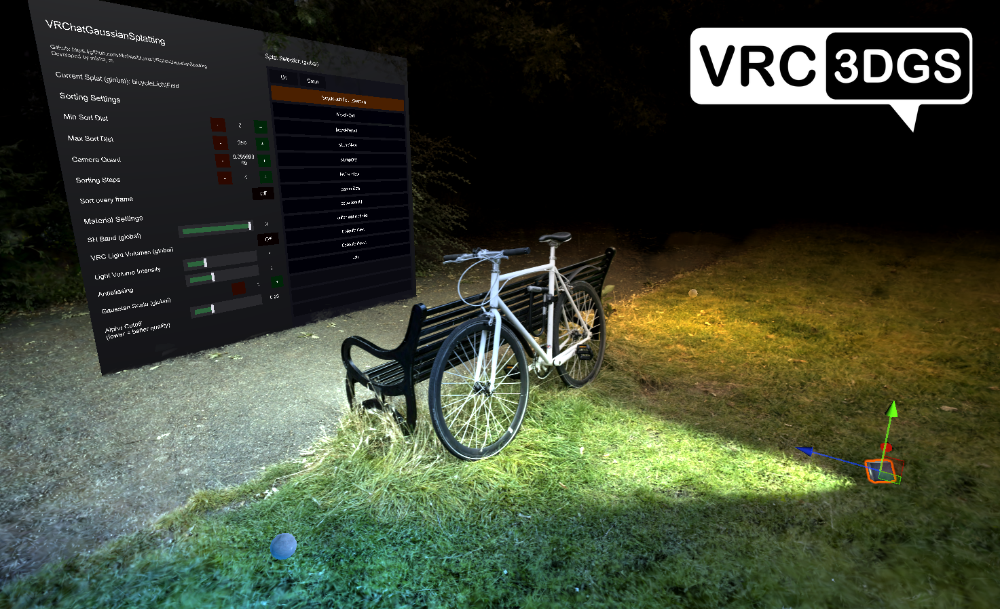

# Gaussian Splatting for Unity 6 (URP)




Gaussian splatting for plain Unity 6 with the Universal Render Pipeline: runtime camera-sorted
rendering, a `.ply` / `.spz` importer with an LOD pyramid, a gallery and control UI, automatic editor
Scene-view sorting, and terrain-collider / re-import tools.

This is a port of [MichaelMoroz/VRChatGaussianSplatting](https://github.com/MichaelMoroz/VRChatGaussianSplatting) (v4)
away from VRChat. The VRChat SDK and UdonSharp are gone; everything runs as ordinary MonoBehaviours
under URP. See [Differences from the VRChat version](#differences-from-the-vrchat-version).

**[日本語はこちら](#gaussian-splatting-for-unity-6-urp日本語)**

## Features

- Sorted-only runtime rendering through `GaussianSplatRenderer` — all active splats are combined
  into world space and sorted together as one renderer
- Importer for `.ply` and `.spz` splats: `Gaussian Splatting > Import Splats...`
- Import modes: **LOD** (combined, with a level-of-detail hierarchy) and **Standalone**
  (self-rendering, precomputed sorting)
- **LOD hierarchy** — an import-time LOD pyramid; the runtime selects per-chunk detail against a
  scene-wide, per-platform splat budget, with quality tiers and an LOD Splat Cap slider
- **Gallery** UI: list splats and show one at a time
- Automatic scene renderer + world-space control UI when splats are present
- Automatic, editor-only Scene-view sorting for every `GaussianSplatObject`
- Editor tools: **terrain collider** generation, and **re-import** (exact / edit-settings) from a
  splat's stored import metadata
- Android/Quest build conversion to the no-geometry splat shaders
- **Light Volumes** — REDSIM's [VRCLightVolumes](https://github.com/REDSIM/VRCLightVolumes) (v2.1.3, MIT)
  vendored under `LightVolumes/` and running as plain MonoBehaviours; splats can be tinted by the
  baked ambient volume at each splat position
- Bilingual UI (English / 日本語)

## Requirements

- Unity 6 (developed against 6000.0.63f1)
- Universal Render Pipeline with **Render Graph** (compatibility mode will not work)
- The **Editor Coroutines** package (`com.unity.editorcoroutines`) — required by the Light Volumes
  baking tools
- A colour target **with an alpha channel** — see [Project setup](#project-setup); this is the one
  that silently ruins the picture if you get it wrong
- DX11/DX12/Vulkan for the geometry-shader path; Quest uses the no-geometry path instead

## Project setup

The splats need three things from the project itself, none of which live in this folder. Run

**`Gaussian Splatting > Setup URP Renderer`**

and it will check and fix all of them:

1. **`GaussianSplatRendererFeature` on every URP renderer.** Without it nothing draws at all — the
   splat shaders deliberately sit outside URP's own transparent pass.
2. **An alpha channel in the camera colour target.** URP's default (HDR on, HDR Precision 32-bit)
   selects `B10G11R11_UFloatPack32`, which has *no alpha*. The splats composite with
   `Blend OneMinusDstAlpha One` and stencil out fully-covered pixels by testing destination alpha, so
   with no alpha the result is wrong — and nothing warns you. The fix disables HDR, giving
   `R8G8B8A8_SRGB`, which is what the shaders were written against.
3. **MSAA off, Render Graph on.** The splat pass reads the colour target mid-frame, so MSAA cannot
   be used; and the pass is a Render Graph pass, so compatibility mode never runs it.

The same checks appear as errors with a **Fix** button on the `GaussianSplatRenderer` inspector.

### Generated resources

The shared sorting / combine RenderTextures and draw-pass meshes are pregenerated assets committed
under `RTPool/` — the editor bake assigns them, and nothing is created at runtime. Per-scene combined
resources are generated into `Assets/Temp/GS_<scene>/` on demand. If the renderer logs *"Splat Render
Order texture is not assigned"*, the shaders are usually not compiling; see
[Unity 6 porting notes](#unity-6-porting-notes).

### VR

Set up XR the usual way: **XR Plug-in Management > OpenXR**, with **Render Mode = Single Pass
Instanced**. The shaders were already written for single-pass instanced stereo, and the renderer
feature allocates its copies from the camera target descriptor and blits with
`Blitter.BlitCameraTexture`, both of which are XR-aware.

Quest standalone builds go through the Android pre-build pass, which swaps the geometry-shader
shaders for the no-geometry ones (Quest has no geometry shaders) and replaces the point meshes with
zero-sized quads. `Gaussian Splatting > Convert Open Scene To Android No-Geometry (preview)` applies
the same conversion in the editor for testing. That path is intact but **has not been verified on a
headset**.

## Workflow

1. Open `Gaussian Splatting > Import Splats...`.
2. Add one or more `.ply` / `.spz` files, choose an output folder, and pick an **Import Mode**.
3. Configure the import options and import.
4. Drag the imported prefabs into the scene. The editor automatically creates the scene
   `GaussianSplatRenderer` and the control UI when needed.
5. Tune material/render settings from the renderer inspector or the in-scene UI.

### Import modes

- **LOD** (default) — a combined `GaussianSplatObject` with a downsampled LOD pyramid. The combiner
  selects per-chunk detail by camera distance and a scene-wide splat budget; full-detail LOD0 is
  preserved up close.
- **Standalone** — a self-rendering mesh + material with **precomputed direction-based sorting**
  baked in. Renders without `GaussianSplatRenderer`, but uses more texture memory and can introduce
  artifacts.

### Import option notes

- `Import Spherical Harmonics` + `Max SH Band` — memory scales with the chosen band; disabled
  forces SH0. `SH Compression` picks `None` (RGB565), `BC1` (4 bpp) or `BC7` (8 bpp).
- **Transform / cleanup**: `Crop To Bounds` (preview box handle), `Horizon Alignment` /
  `Wall Alignment` (pick points in the preview), `Normalize Size`.
- **LOD mode**: `Chunk Size`, `LOD Resampling Rate` / `LOD Reused Splats` tune the pyramid.
- **Standalone mode only**: `sRGB Color Correction` is the exact colour/compositing path (two extra
  full-screen colour copies). Without it the splat falls back to back-to-front blending and
  multi-pass rendering will not work. `Multi-Pass Rendering` + `Max Alpha Mask Count` split the
  splat into sequential chunks with optional occlusion masks — each mask costs one more colour copy.
- `.ply` files larger than 2 GB are not supported. Large imports are limited by available RAM.

## In-scene UI

The editor creates a world-space control canvas automatically when splats are present and the scene
has none. Since the port is single-user, **every control is local** — nothing is networked.

- **Gallery**: add splat objects to the UI's gallery list; when the list has entries, only the
  selected splat renders. Objects not in the list are never touched. (The master-lock toggle remains
  as a UI switch, but there is no instance master to lock against.)
- Quality presets (Very Low / Low / Medium / High), SH Band, Light Volumes toggle + intensity,
  Gaussian Scale, Alpha Cutoff / Cull, Antialiasing, Camera Quantization, LOD Splat Cap (when LOD
  splats are present), and an **Advanced Settings** toggle.
- Language: English / 日本語.
- The 3D click toggles (`QualityToggle`, `TurnOnToggle`) need a `Collider` on the object and a
  `PhysicsRaycaster` on the camera; the UI builder wires both up.

## Terrain collider

`Gaussian Splatting > Generate Terrain Collider...` (or the `GaussianSplatObject` context menu)
rasterizes a splat into a heightmap on the GPU and builds a Unity `TerrainData` + `TerrainCollider`.
It is a 2.5D (top-down) collider — good for ground/terrain, not overhangs or interiors.

## Differences from the VRChat version

Removed, because they have no meaning outside VRChat:

- **Networked/synced controls.** The upstream synced the gallery selection and master lock across
  the instance; here every control is local and the local user always counts as the master.
- **The photo camera and mirror paths.** `_VRChatCameraMode` and `_VRChatMirrorMode` are always 0
  outside VRChat, so these branches were dead — but they still cost a second render-order texture
  per pool bucket, a second combined colour pass, and per-frame photo-camera bookkeeping.

Changed:

- **Interaction.** `QualityToggle` and `TurnOnToggle` used VRChat's gaze-press `Interact()`. They now
  implement `IPointerClickHandler`, i.e. an ordinary screen click. UI buttons are wired to the
  MonoBehaviour methods directly with persistent listeners instead of Udon's
  `SendCustomEvent(string)` indirection.
- **Sorting is driven from `RenderPipelineManager.beginCameraRendering`,** not `Update`. The sorted
  render order is global material state, so it has to be rebuilt for whichever camera is about to be
  drawn. As a side effect Scene view sorting works — under an SRP, `Camera.onPreCull` never fires.
- **`GrabPass` is gone.** See [Replacing GrabPass under URP](#replacing-grabpass-under-urp).
- **Light Volumes run without Udon.** REDSIM's package guards every VRChat dependency behind
  `#if UDONSHARP`, so the vendored copy under `LightVolumes/` compiles as plain MonoBehaviours
  as-is — the `LightVolumeManager` binds the same `_UdonLightVolume*` shader globals that the
  splat shaders sample. Baking works with the Progressive Lightmapper (or Bakery if installed).
  The VRChat-only extras (AudioLink/TVGI integrations, ASE shaders, attribution prefabs) are not
  vendored.

Kept: the importer, the LOD system, the gallery UI, combined rendering, the terrain-collider and
re-import tools, and the Android/Quest no-geometry build pass.

## Unity 6 porting notes

Two things broke on the way from Unity 2022.3 (which is what VRChat uses) to Unity 6, in ways that
did not look like what they were.

### `#pragma` in include files

Unity ignores Unity-specific `#pragma` directives in files pulled in with a plain `#include`;
`#include_with_pragmas` exists to opt into them. **Unity 2022.3 honoured them from a plain `#include`
anyway. Unity 6 does not**, and drops the snippet:

> Both vertex and fragment programs must be present in a shader snippet. Excluding it from
> compilation.

`GS.cginc` and `FullscreenCommon.cginc` hold the entry-point pragmas for several shaders, so all of
them were dead on Unity 6 — and the symptom surfaced a long way away: the shaders reported
`isSupported = false`, so their materials reported `HasProperty("_GS_Positions") == false`, so the
renderer found zero splats, so it never bound the sorting RenderTextures, so you got *"Splat Render
Order texture is not assigned."* Both files are included with `#include_with_pragmas`.

### Magenta materials

`Shader.isSupported` does **not** tell you whether URP can draw a shader. The Standard shader
compiles and reports `isSupported = true`; it simply has no pass URP knows (`ForwardBase` /
`ForwardAdd`), so URP substitutes the error material. The check that matters is whether any pass
carries a `LightMode` tag URP recognises — or no `LightMode` tag at all, which counts as
`SRPDefaultUnlit`.

Materials in this package are all URP-drawable, and `VerifyMaterials` (below) keeps them that way.

## Verification

Three batch-mode entry points, useful in CI and for checking a change did not quietly break
something:

```bash
Unity.exe -batchmode -quit -projectPath . -executeMethod \
  GaussianSplatting.Editor.GaussianSplatCiChecks.CheckShaders
Unity.exe -batchmode -quit -projectPath . -executeMethod \
  GaussianSplatting.Editor.GaussianSplatCiChecks.VerifyMaterials
Unity.exe -batchmode -quit -projectPath . -executeMethod \
  GaussianSplatting.Editor.GaussianSplatCiChecks.VerifyScenes
```

- **`CheckShaders`** — fails on shader errors, *and* on the "must be present in a shader snippet"
  warning, which is only a warning but means the shader renders nothing at all.
- **`VerifyMaterials`** — fails on any material URP cannot draw, judged by pass `LightMode` tags
  rather than `Shader.isSupported` (see [Magenta materials](#magenta-materials)).
- **`VerifyScenes`** — opens each example scene and checks it is actually playable: no missing
  scripts, a camera, an `EventSystem` with `InputSystemUIInputModule`, a `PhysicsRaycaster`, and UI
  buttons whose `onClick` points at something. Grepping the YAML cannot see any of this — components
  are stored by script GUID, not by name.

None of these need a graphics device. Note that `Shader.isSupported` *does*, which is why it is not
used: under `-batchmode` it reports false for every shader.

Four more entry points verify the branch's optimizations are output-identical — those *do* need a
graphics device; see [Optimization verification](#optimization-verification).

The example scenes and prefabs were cleaned of leftover VRChat components with the tools under
`Gaussian Splatting > Cleanup`; they are also what to reach for after pulling upstream changes.

## Rendering pipeline

- Runtime rendering is sorted-only, front-to-back, with sorted render-order textures.
- SH selection is controlled numerically through `_SHBand`, clamped by the textures the imported
  material actually has.
- Splats should not rely on MSAA; the renderer disables it on the camera it sorts for.

### Replacing GrabPass under URP

URP has no `GrabPass`, and it draws the entire transparent queue in a single `DrawObjectsPass`, so
nothing can be injected between two render queues. `_CameraOpaqueTexture` is no help either: URP
copies it once, *before* transparents, and the splat chain needs the colour target mid-sequence.

The way out is that URP's transparent pass only picks up three `LightMode` tags. Giving the splat
shaders their own tags takes them out of URP's pass entirely, and `GaussianSplatRendererFeature` then
owns the whole sequence at `AfterRenderingTransparents`, reproducing the GrabPass chain one-for-one:

```
copy colour -> _GS_LinearBackground        (was GrabPass "_LinearBackground")
ToSRGB                                     rewrites the target in gamma space, alpha 0
splat chunk
  copy colour -> _GS_GrabTexture           (was GrabPass {})
  AlphaDepthMask                           stencils out fully covered pixels
splat chunk ...
copy colour -> _GS_SRGBBackground
ToLinear                                   subtracts the background back out, returns to linear
```

`_GS_LinearBackground` stays bound all the way to `ToLinear`, which reads it a second time — that is
what lets it subtract the background's contribution out of the front-to-back accumulation, and it is
why the copy is not folded into `ToSRGB`.

The render queues and the material array are untouched, so the importer, the combiner and every
imported `.mat` keep working exactly as before. `GaussianSplatRuntimeRegistry` carries the one thing
the feature cannot work out for itself: which render queues hold an `AlphaDepthMask`, since the
importer derives them from each splat's material array.

The pass is an *unsafe* Render Graph pass, because a raster pass cannot read and write the same
texture — which would force a pass split per copy.

### Cursed radix sort

The original sorter is a fragment-shader radix sort built on mipmap-based prefix sums, sorting 4
bits at a time over 16-value digits. It was written this way because VRChat offers no compute
shaders, buffers or atomics. On this branch it is the **fallback and editor-preview path only** —
the runtime uses a compute-shader radix sort that produces the identical order (see
[Runtime optimizations](#runtime-optimizations)). `Sorting Steps` trades ordering accuracy against
cost on the fallback path.

### Ellipsoid screen projection

Splats are rendered as projected billboards, but the ellipse is fitted by sampling the projected
tangent outline of the ellipsoid rather than using the center-Jacobian affine approximation that
standard 3DGS uses. That approximation shows up as blur, shape drift and scene inconsistency,
especially in VR where the camera can be very close to the splats with a very large field of view.
Numerically this recovers the same projected ellipse as exact ellipsoid-projection approaches such as
"Projecting Gaussian Ellipsoids While Avoiding Affine Projection Approximation" (arXiv:2411.07579v2),
via a float-only outline-sampling fit. It also extends naturally to distorted camera models.

## Runtime optimizations

The `perf/runtime-optimizations` branch carries a set of performance changes on top of the v4 port.
The standing rule for every one of them: **the rendered output must not change.** Each change is
either bit-identical by construction or proven byte-identical by CI (off-screen play-mode frames
compared byte-for-byte against the unoptimized path); speed-for-quality tradeoffs were explicitly
out of scope. Several candidates were benchmarked first and *rejected* when the measurement said
they would not pay — see [Measured before built](#measured-before-built).

### GPU sort

- **Compute radix sort** (`RadixSort/RadixSortCompute.compute`). The blit sort's scatter step is
  really a gather: every output element walks a mip pyramid and scans a 16-key group to find its
  rank — tens of texture loads per element per round, six rounds per frame, and in VR the sort runs
  every frame. The compute path is a standard stable LSD radix sort over the same key bits
  (7..30 of the positive-float camera distance): three 8-bit rounds, 256 threads × 4 elements per
  group, an LDS local sort via stable 1-bit splits, one linear scatter per round. Ties keep
  original-index order exactly like the blit path and a fragment copy writes the ids into the same
  Morton-layout order texture, so the draw side is untouched and the resulting order is
  **identical element-for-element** (CI-verified on every rank). The blit path remains as the
  no-compute fallback and the editor preview. *Device-verified faster on Quest.*
- **Blit scratch textures are no longer allocated when the compute sort is active** (~10 MB of
  VRAM per bucket). The fallback auto-creates them on its first use.
- **The order copy rasterizes only the live Morton rectangle.** The order texture is bucket-sized
  (up to 4096²) but ranks `[0, NextPOT(count))` occupy a power-of-two rectangle at the origin, and
  the draw culls `id >= actualSplatCount` *before* the order fetch — so the fullscreen copy
  (67 MB of writes per frame at 16M capacity, almost all sentinel values) now covers just that
  rectangle. Sort cost on the example scene (RTX 5080): 0.164 → 0.112 ms.

### Per-frame combine

- **Band-limited clears and combine passes.** Every frame, per camera, the combiner cleared four
  bucket-sized textures and ran four fullscreen combine passes — 0.614 ms/frame on an RTX 5080 for
  the example scene, where the live splats occupied 0.4% of the texels (the ARGBFloat positions
  clear alone wrote 256 MB/frame). Consecutive combined ids fill 4×4 texel blocks row-band by
  row-band, and every consumer culls out-of-range ids before reading, so the clears and combine
  passes now rasterize a quad over only the block rows covering `[0, hard budget)`:
  0.614 → 0.044 ms/frame. `GaussianSplatBandBlit.ForceFullscreen` restores the old path (it is
  also the CI baseline). These are pure bandwidth/raster savings, so the absolute win should be
  larger on mobile GPUs.
- **The dead per-camera colour set is gone.** `CombinedColorsCamera` was a fossil of the removed
  VRChat photo-camera path: bound by C#, declared by no shader, created at init — 64 MB of VRAM at
  the 16M bucket for a texture nothing ever read or wrote. Removed end to end (fields, bucket
  arrays, pooled assets).

### Android / no-geometry path

- **Index-only splat meshes.** The no-geom vertex shader reads nothing but `SV_VertexID`, which on
  an indexed draw *is* the index-buffer value — so the Android build conversion no longer bakes
  `splatCount × 4` zeroed vertices (48 MB per million splats in the APK, RAM and VRAM; 192 MB
  across the example scene). The mesh keeps a 4-vertex dummy buffer and encodes `splat*4+corner`
  purely in the index values, the same trick the importer already uses for its 3-vertex source
  meshes. Index values and topology are unchanged, so the draw is bit-identical.
- **Per-corner dedupe in the vertex path.** The no-geom vertex shader runs 4× per splat (8× in
  stereo). It now resolves the render order and fetches the colour *first*, alpha-culls, and only
  then fetches position/scale/rotation — alpha-culled splats cost one fetch instead of four. The
  projection helpers take the values the caller already computed (centre clip position,
  object-space camera) instead of recomputing them, and `log2(e)` is folded into the falloff
  exponent so the fragment shader uses native `exp2`.
- **The OKLCH colour shift is skipped when it is the identity** (`_OKLCHShift == 0, _Gamma == 1`),
  dropping a per-corner RGB→Oklab→Oklch→Oklab→RGB round trip of transcendentals in the default
  case.

### URP feature and C# per-frame cost

- **The grab-pass chain runs only for splats that need it.** Only sRGB-corrected imports have the
  ToSRGB/ToLinear/AlphaDepthMask passes that read the colour copies; for everything else (including
  the Android fake-sRGB path) the feature now draws the splats directly — no copies, no empty
  passes, and no forced intermediate texture, which URP itself warns is expensive on untethered VR.
- **Per-frame C# allocations are gone from the hot path**: the primary-renderer check reuses its
  verdict behind an enable/disable generation counter instead of a `FindObjectsByType` scan twice
  per frame, and the sort binding caches the instantiated material array instead of allocating a
  fresh copy from `renderer.materials` every frame.
- **The in-world control UI is opt-out** (`Generate Control UI` on the renderer): its per-frame
  `RefreshUI` allocations are real GC pressure in VR, and a display-only scene does not need the
  panel at all.

### Measured before built

The branch's rule of thumb is to benchmark candidates before implementing them
(`Editor/GaussianSplatCombineBenchmark.cs`, batchmode). One example of each direction:

- *Rejected:* merging the four combine passes into one MRT pass looked like an obvious 4×-redundancy
  win — the selection mip-descent runs once per pass. Measured, each pass cost *less* than a plain
  fullscreen copy (0.044–0.048 ms vs 0.058 ms): 99.6% of fragments early-out and discard, so the
  descent redundancy was confined to 0.4% of the texels and an MRT merge would have saved nothing.
- *Accepted:* the same measurement showed the real cost was the fullscreen rasterization itself
  (the clears alone were 2.4× the combine passes), which became the band-limited blits above.

### Optimization verification

The equivalence checks are batchmode entry points like the ones under [Verification](#verification),
but these need a graphics device (run **without** `-nographics` and without `-quit`; they exit on
their own):

- **`VerifySortRuntime`** — the compute sort must not touch the blit scratch textures, the fallback
  must auto-create them, and both paths must write identical ids on every readable rank (and a
  permutation).
- **`VerifyPlayModeSmoke`** — enters play mode, renders the example scene off-screen through URP
  with each sort path, and requires byte-identical frames.
- **`VerifyAndroidNoGeom`** — applies the Android conversion, checks the exact index pattern of the
  index-only meshes, then renders with them and with legacy-style 4N-vertex rebuilds:
  byte-identical frames.
- **`VerifyBandBlits`** — pins the band quad's exact texel coverage and orientation on a probe
  texture, then requires the band-limited and forced-fullscreen frames to be byte-identical.

Device-verified on Quest: the compute sort. Everything else is proven output-identical locally, but
its mobile *timing* is extrapolated from the desktop measurements (the wins are bandwidth/raster
and memory, which transfer conservatively).

## Editor Scene view sorting

- Automatic for `GaussianSplatObject`, editor-only, with its own transient sorting resources.
- Skips standalone precomputed-sorting materials.

## Credits

- Ported from [MichaelMoroz's VRChatGaussianSplatting](https://github.com/MichaelMoroz/VRChatGaussianSplatting) (v4),
  itself a heavily modified version of [lambdalemon's gaussian splats](https://github.com/lambdalemon/vrcsplat)
- `.PLY` importer originally adapted from [aras-p's UnityGaussianSplatting](https://github.com/aras-p/UnityGaussianSplatting)
- The radix sort uses [d4rkpl4y3r's mipmap prefix sum trick](https://github.com/d4rkc0d3r/CompactSparseTextureDemo)
- Light Volumes are [REDSIM's VRCLightVolumes](https://github.com/REDSIM/VRCLightVolumes) (MIT),
  vendored under `LightVolumes/`

## License

MIT, Copyright (c) 2025 Mykhailo Moroz. See `LICENSE`.

---

# Gaussian Splatting for Unity 6 (URP)（日本語）

素の Unity 6 + Universal Render Pipeline で動くガウシアンスプラッティングです。ランタイムのカメラ
ソートレンダリング、LOD ピラミッド付きの `.ply` / `.spz` インポーター、ギャラリー・コントロール UI、
エディタ Scene ビューの自動ソート、地形コライダー / 再インポートツールを備えています。

[MichaelMoroz/VRChatGaussianSplatting](https://github.com/MichaelMoroz/VRChatGaussianSplatting)（v4）を
VRChat から切り離した移植版です。VRChat SDK と UdonSharp は含まれず、すべて通常の MonoBehaviour と
して URP 上で動作します。

## 必要環境

- Unity 6（6000.0.63f1 で開発）
- Universal Render Pipeline + **Render Graph**（互換モードでは動きません）
- **アルファチャンネル付き**のカラーターゲット — 下の「プロジェクト設定」参照。ここを間違えると
  警告なしに絵が壊れます
- ジオメトリシェーダー経路は DX11/DX12/Vulkan。Quest は No-Geometry 経路を使います

## プロジェクト設定

**`Gaussian Splatting > Setup URP Renderer`** を実行すると、以下の 3 点を検査して修正します。

1. **すべての URP レンダラーに `GaussianSplatRendererFeature` を追加。** これがないと何も描画され
   ません（スプラットシェーダーは意図的に URP の透明パスの外にあります）。
2. **カメラのカラーターゲットにアルファチャンネルを確保。** URP のデフォルト（HDR オン・32bit）は
   アルファなしの `B10G11R11_UFloatPack32` になります。スプラットは `Blend OneMinusDstAlpha One`
   で合成し、デスティネーションアルファで被覆済みピクセルをステンシル除外するため、アルファなしでは
   結果が壊れます。修正では HDR を無効化して `R8G8B8A8_SRGB` にします。
3. **MSAA オフ・Render Graph オン。**

同じ検査は `GaussianSplatRenderer` のインスペクタにも **Fix** ボタン付きで表示されます。

### VR

通常どおり **XR Plug-in Management > OpenXR**、**Render Mode = Single Pass Instanced** で設定して
ください。シェーダーはシングルパスインスタンス立体視前提で書かれており、RendererFeature も XR 対応
の API でコピー/ブリットを行います。Quest ビルドは Android プリビルドパスで No-Geometry シェーダー
に変換されます（`Gaussian Splatting > Convert Open Scene To Android No-Geometry (preview)` でエディタ
内でも試せます）。**実機での検証はまだ行っていません。**

## 使い方

1. `Gaussian Splatting > Import Splats...` を開く。
2. `.ply` / `.spz` ファイルを追加し、出力フォルダと**インポートモード**を選ぶ。
3. オプションを設定してインポート。
4. 生成されたプレハブをシーンに配置。シーンの `GaussianSplatRenderer` とコントロール UI は必要に
   応じて自動生成されます。
5. レンダラーのインスペクタまたはシーン内 UI で設定を調整。

### インポートモード

- **LOD**（デフォルト）— ダウンサンプルした LOD ピラミッド付きの結合 `GaussianSplatObject`。
  カメラ距離とシーン全体のスプラット予算でチャンクごとの詳細度を選択し、近距離ではフル詳細の
  LOD0 が維持されます。
- **Standalone** — 方向ベースの事前計算ソートを焼き込んだ自己描画メッシュ + マテリアル。
  `GaussianSplatRenderer` なしで描画できますが、テクスチャメモリを多く使い、アーティファクトが
  出ることがあります。

## シーン内 UI

スプラットがあるシーンには世界空間のコントロールキャンバスが自動生成されます。この移植版は
シングルユーザーなので、**すべてのコントロールはローカル**です（ネットワーク同期はありません）。

- **ギャラリー**: UI のギャラリーリストに登録したスプラットのうち、選択中の 1 つだけを表示。
  リスト外のオブジェクトには一切触れません。
- 品質プリセット / SH バンド / ガウススケール / アルファカットオフ・カリング / アンチエイリアス /
  LOD スプラット上限 / 詳細設定トグル / 言語（英語・日本語）
- 3D クリックトグル（`QualityToggle` / `TurnOnToggle`）はオブジェクトの `Collider` とカメラの
  `PhysicsRaycaster` が必要です（UI ビルダーが自動配線します）。

## VRChat 版との違い

- **ネットワーク同期を削除** — ギャラリー選択・マスターロックの同期は廃止し、全操作ローカル。
- **Light Volumes は Udon なしで動作** — REDSIM のパッケージ（v2.1.3、MIT）を `LightVolumes/` に
  同梱。VRChat 依存はすべて `#if UDONSHARP` ガード内のため素の MonoBehaviour としてそのまま
  コンパイルされ、`LightVolumeManager` がスプラットシェーダーの参照するグローバル値を設定します。
  ベイクは Progressive Lightmapper（Bakery 導入済みなら Bakery も）で可能。要
  `com.unity.editorcoroutines` パッケージ。
- **フォトカメラ / ミラー経路を削除** — VRChat 外では常に無効なのに、プールバケットごとの追加
  レンダーオーダーテクスチャや追加カラーパスを消費していました。
- **操作系を変更** — `Interact()`（注視プレス）は `IPointerClickHandler`（通常クリック）に。UI
  ボタンは Udon の `SendCustomEvent` 間接呼び出しではなく MonoBehaviour メソッドへの永続リスナー。
- **ソートを `beginCameraRendering` 駆動に変更** — 描画直前のカメラに合わせてソートを再構築。
  副作用として Scene ビューのソートも機能します。
- **`GrabPass` を全廃** — URP には GrabPass がないため、`GaussianSplatRendererFeature` が
  `AfterRenderingTransparents` で GrabPass 連鎖を一対一で再現します（詳細は英語版
  「Replacing GrabPass under URP」参照）。

維持: インポーター、LOD システム、ギャラリー UI、結合レンダリング、地形コライダー / 再インポート
ツール、Android/Quest No-Geometry ビルドパス。

## 検証

CI 向けのバッチモードエントリポイントが 3 つあります（`CheckShaders` / `VerifyMaterials` /
`VerifyScenes`、コマンドは英語版参照）。シェーダーのコンパイル、URP で描画不能な（マゼンタになる）
マテリアル、サンプルシーンの再生可能性（欠落スクリプト・EventSystem・PhysicsRaycaster・ボタン配線）
をそれぞれ検査します。いずれもグラフィックスデバイス不要です。

これに加えて、最適化の等価性検証用のエントリポイントが 4 つあります（下の「ランタイム最適化」
参照。こちらはグラフィックスデバイスが必要で、`-nographics` と `-quit` は付けずに実行します）。

## ランタイム最適化

`perf/runtime-optimizations` ブランチには v4 移植の上に一連の最適化が載っています。全変更に共通する
原則は **「描画結果を一切変えない」** ことです。各変更は構造上ビット不変であるか、CI がプレイモードの
オフスクリーン描画をバイト単位で比較して同一性を証明しています。品質を速度と引き換えにする変更は
対象外としました。また、候補は実装前にベンチマークで効果を確認し、**効果が出ないと測定された案は
実装せず棄却**しています（後述）。

### GPU ソート

- **コンピュートシェーダー版基数ソート**（`RadixSort/RadixSortCompute.compute`）。従来の blit ソートの
  スキャッタは実態がギャザーで、各出力要素がミップピラミッドを歩き 16 キーのグループを走査して自分の
  順位を探すため、要素あたり数十回のテクスチャロード × 6 ラウンドが毎フレーム発生していました。
  コンピュート版は同じキービット（カメラ距離の正の float のビット 7..30）に対する標準的な安定 LSD
  基数ソート（8bit × 3 ラウンド、256 スレッド × 4 要素/グループ、LDS 内は安定 1bit 分割）です。
  同値の順序も blit 版と完全一致し、出力順序は**要素単位で同一**（CI が全ランクを検証）。blit 版は
  コンピュート非対応時のフォールバックとエディタプレビューとして残っています。*Quest 実機で高速化を
  確認済み。*
- **コンピュートソート使用時は blit 用スクラッチテクスチャ（約10MB）を確保しない。** フォールバックは
  初回使用時に自動生成します。
- **オーダーコピーはライブな Morton 矩形のみラスタライズ。** オーダーテクスチャはバケットサイズ
  （最大 4096²）ですが、ランク `[0, NextPOT(count))` は原点の 2 の冪矩形に収まり、描画側はフェッチ前に
  `id >= actualSplatCount` で cull します。16M 容量ではほぼ全部が番兵値の毎フレーム 67MB 書き込み
  だったフルスクリーンコピーが、その矩形だけになりました（RTX 5080・サンプルシーンでソート全体
  0.164 → 0.112 ms）。

### 毎フレームの combine

- **クリアと combine パスのバンド限定化。** 毎フレーム・カメラごとに、バケットサイズのテクスチャ
  4 枚のクリア + フルスクリーン combine 4 パスが走っていました（RTX 5080・サンプルシーンで
  0.614 ms/フレーム。ライブなスプラットはテクセルの 0.4% で、ARGBFloat の positions クリアだけで
  毎フレーム 256MB 書き込み）。連続した combined id は 4×4 テクセルブロックの行バンドを順に埋め、
  全消費者は読み取り前に範囲外 id を cull するため、クリアと combine は `[0, ハード予算)` を覆う
  ブロック行だけをラスタライズするようになりました：0.614 → 0.044 ms/フレーム。
  `GaussianSplatBandBlit.ForceFullscreen` で旧経路に戻せます（CI のベースラインでもあります）。
  純粋な帯域・ラスタ削減なので、モバイル GPU では絶対値がさらに大きくなる見込みです。
- **死んでいたカメラ別カラーセットを削除。** `CombinedColorsCamera` は削除済み VRChat フォトカメラ
  経路の化石で、C# がバインドするだけでどのシェーダーも宣言しておらず、読み書きゼロのまま 16M
  バケットで 64MB の VRAM を確保していました。フィールド・バケット配列・プールアセットまで完全に
  削除しました。

### Android / No-Geometry 経路

- **インデックスオンリーのスプラットメッシュ。** No-geom 頂点シェーダーは `SV_VertexID` しか読まず、
  インデックスドローではそれはインデックスバッファの値そのものです。そこで Android ビルド変換は
  `スプラット数 × 4` 個のゼロ頂点（100 万スプラットあたり 48MB、サンプルシーン全体で 192MB が
  APK・RAM・VRAM に載っていた）を焼き込むのをやめ、4 頂点のダミーバッファ + インデックス値に
  `splat*4+corner` を符号化する方式にしました（インポーターの 3 頂点ソースメッシュと同じトリック）。
  インデックス値もトポロジも不変なので描画はビット同一です。
- **頂点パスのコーナー間重複排除。** No-geom 頂点シェーダーはスプラットあたり 4 回（ステレオで
  8 回）走ります。まず描画順を解決して色だけをフェッチし、アルファ cull を通過した場合のみ
  位置・スケール・回転をフェッチするよう変更（cull されるスプラットのフェッチが 4 回 → 1 回）。
  投影ヘルパーは呼び出し元が計算済みの値（クリップ空間中心・オブジェクト空間カメラ位置）を受け取り、
  減衰指数に `log2(e)` を畳み込んでフラグメント側をネイティブ `exp2` にしました。
- **OKLCH カラーシフトが恒等変換のとき**（`_OKLCHShift == 0, _Gamma == 1`）は、コーナーごとの
  RGB→Oklab→Oklch→Oklab→RGB の超越関数往復をスキップします。

### URP フィーチャと C# の毎フレームコスト

- **グラブパス連鎖は必要なスプラットに限定。** ToSRGB/ToLinear/AlphaDepthMask を持つのは sRGB
  色補正付きインポートだけです。それ以外（Android の fake-sRGB 含む）はコピーも空パスもなしで直接
  描画し、URP が「untethered VR では高価」と警告する中間テクスチャの強制も外しました。
- **ホットパスの C# アロケーションを排除**：プライマリレンダラー判定は enable/disable 世代カウンタで
  結果を再利用（毎フレーム 2 回の `FindObjectsByType` 走査を廃止）、ソートバインドは
  `renderer.materials` の毎フレーム配列生成をやめてキャッシュを使用。
- **ワールド内コントロール UI をオプトアウト化**（レンダラーの `Generate Control UI`）。毎フレームの
  `RefreshUI` による GC は VR のヒッチ要因で、表示専用シーンにはそもそも不要です。

### 測ってから作る

このブランチでは候補を実装前にベンチマーク（`Editor/GaussianSplatCombineBenchmark.cs`、バッチ
モード）で確認します。両方向の例：

- *棄却:* combine 4 パスの MRT 統合は「選択ピラミッド降下 × 4 の重複排除」として有望に見えましたが、
  測定では各パスが単純なフルスクリーンコピーより安く（0.044–0.048 ms 対 0.058 ms）、フラグメントの
  99.6% が早期 discard するため降下の重複は 0.4% のテクセルにしか存在せず、統合しても何も節約でき
  ないことが判明 → 実装せず。
- *採用:* 同じ測定で本当のコストはフルスクリーンラスタ自体（クリアだけで combine の 2.4 倍）と判明
  → 上記のバンド限定ブリットになりました。

### 最適化の検証

等価性検証のバッチモードエントリポイント（グラフィックスデバイス必須、`-nographics`・`-quit` なしで
実行、自力で終了します）：

- **`VerifySortRuntime`** — コンピュートソートが blit スクラッチに触れないこと、フォールバックが
  自動生成すること、両経路が全可読ランクで同一の id（かつ順列）を書くこと。
- **`VerifyPlayModeSmoke`** — プレイモードでサンプルシーンを URP 経由でオフスクリーン描画し、
  両ソート経路のフレームがバイト一致すること。
- **`VerifyAndroidNoGeom`** — Android 変換を適用し、インデックスオンリーメッシュの正確なインデックス
  パターンを検査した上で、旧方式の 4N 頂点メッシュとの描画フレームがバイト一致すること。
- **`VerifyBandBlits`** — バンドクワッドのテクセル被覆と向きをプローブテクスチャで固定検査し、
  バンド限定と強制フルスクリーンのフレームがバイト一致すること。

Quest 実機で確認済みなのはコンピュートソートです。それ以外は出力同一性をローカルで証明済みですが、
モバイルでの*時間短縮の絶対値*はデスクトップ測定からの外挿です（削減対象が帯域・ラスタ・メモリ
なので、保守的に移転すると見ています）。

## ライセンス

MIT, Copyright (c) 2025 Mykhailo Moroz. `LICENSE` を参照してください。
